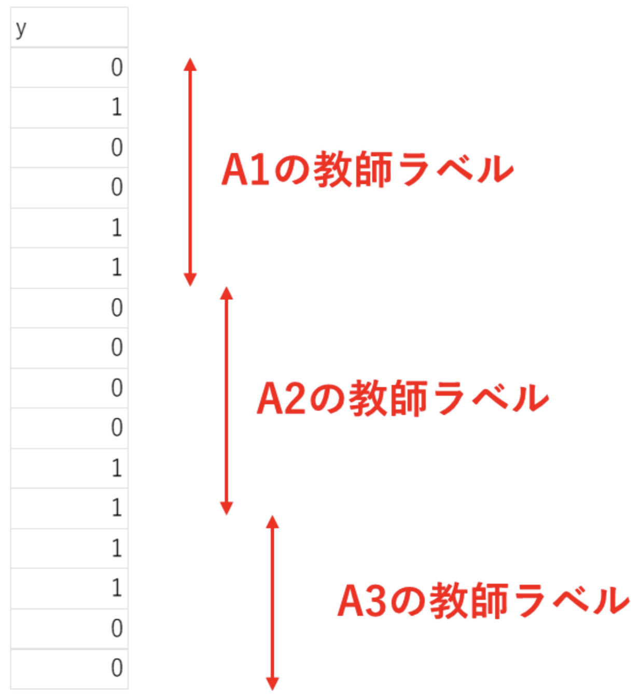

## 説明書

### （１）ML Modelフォルダの中身の説明
　　① df フォルダ：生データ(A1～A4)から特徴量を抽出したデータフレームが出力されるフォルダ

　　　　　　　　　　※ y_data フォルダは教師ラベル（目的変数）が格納されている

　　② data：A1～A4データをそれぞれ格納

　　③ pred：予測結果（0 or 1）が格納されるフォルダ

　　④ code：Pythonコード
　　　
### （２）Pythonコード編集方法：コード内の「編集個所」を修正
　　　① ML Modelフォルダの配置位置指定

　　　② 学習データの指定

　　　③ テストデータの指定

### （３）教師ラベル（目的変数）の準備
　　　df フォルダのy_dataの中に教師ラベルを格納してください。

　　　ラベルは上から（２）- ② or ③で指定した順に並べてください。

　　　例）train_folder = ["A1", "A2", "A3"]と入力したのであれば、

教師ラベルも上から順に"A1", "A2", "A3"の順に上から並べる

※説明変数、目的変数（教師ラベル）の考え方は一般的な機械学習の知識に準拠しています。
